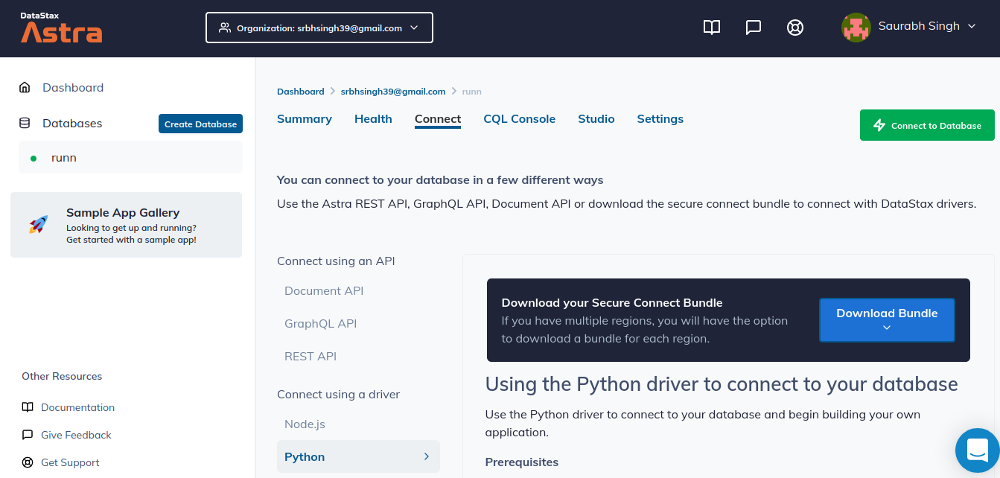

# Runn Backend :tw-1f3c3:

> Note: Please checkout Astra&trade; Database setup on astra branch if you **don't** want to setup Apache Cassandra&trade; locally on your system.

**There are two requirements to setup this project.**
1.  Docker&trade;
2. Virtual Environment

> Note: Make sure you have setup [Datastax Astra](https://astra.datastax.com/ "Datastax Astra")&trade; database before starting the Django Server

------------

<h4>  &trade; Setup for DataStax Astra&trade; Database
</h4>

## 1. Setup Database [[Datastax-Academy&trade;](https://github.com/DataStax-Academy/workshop-crud-with-python-and-node/blob/master/README.md "Datastax-Academy")]

- **✅ Step 1a. SignIn** : 

*expected output*


- **✅ Step 1b. You'll then be directed to the summary page. Locate the button `Add Database`**

*expected output*


- **✅ Step 1b. Choose the free plan and select your region**

**Free tier**: 5GB storage, no obligation

**Provider**: This will determine what cloud provider your database will run on

**Region**: This is where your database will reside physically (choose one close to you or your users). For people in EMEA please use `europe-west-1`, idea here is to reduce latency.

Once your values are selected click "Configure Database"

*expected output*


- **✅ Step 1c. Configure and create your database**

While Astra allows you to fill in these fields with values of your own choosing, please follow our reccomendations to make the rest of the exercises easier to follow. If you don't, you are on your own! :)

- **Database name** - `runn` 

- **Keyspace name** - `runn`

- **Database User name (case sensitive)** - `SUser`

- **Password (case sensitive)** - `SPassword1`. Fill in both the password and the confirmation fields.

- **Create the database**. Click the `Create Database` button.

*expected output*


You will see your new database `pending` in the Dashboard.

*expected output*


The status will change to `Active` when the database is ready, this will only take 2-3 minutes. You will also receive an email when it is ready.

*expected output*


- **✅ Step 1d. View your Database and connect**

Let’s review the database you have configured. Select your new database in the lefthand column.


- **✅ Step 1e. Download your Astra&trade; secure bundle**

Download your Astra&trade; Secure connect bundle and place it in the folder
`src/astra/astra-bundle.zip`



------------

*Clone this repository and follow any **ONE** of the steps below*

> Add a `.env` file in the repository before proceeding and paste the contents from `.env_sample`

<h4>1.   Docker&trade; Setup for Django server
</h4>

- Navigate to the cloned repository and paste the following in your shell
```console
sudo docker-compose run backend python src/manage.py sync_cassandra
```

- Run docker image
```console
sudo docker-compose run -p 8000:8000 backend
```

<h4>2.   Virtual Environment Setup for Django server
</h4>

- This step is only required when you don't have Docker&trade; or cannot connect Docker&trade; image from VSCode&trade;
```console
pip3 install virtualenv
```

- Create virtual environment
```console
virtualenv venv
```

- Activate Virtual Environment
```console
source venv/bin/activate
```

- Install Project Dependencies
```console
pip install -r requirements.txt
```

<<<<<<< HEAD
- Migrate Your Database
```console
python src/manage.py sync_cassandra
```

- Run Django Server
```console
python src/manage.py runserver
```
=======
#### TODOs:
- [X] Add Astra&trade; Connection
>>>>>>> main
